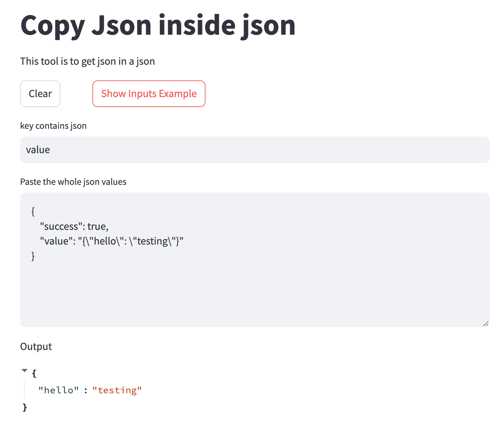
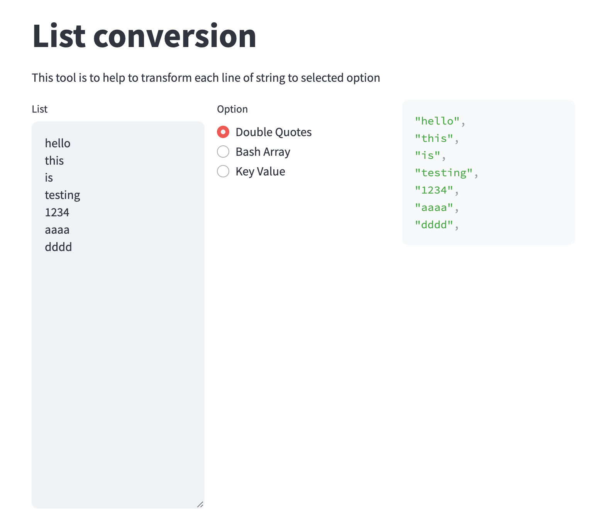
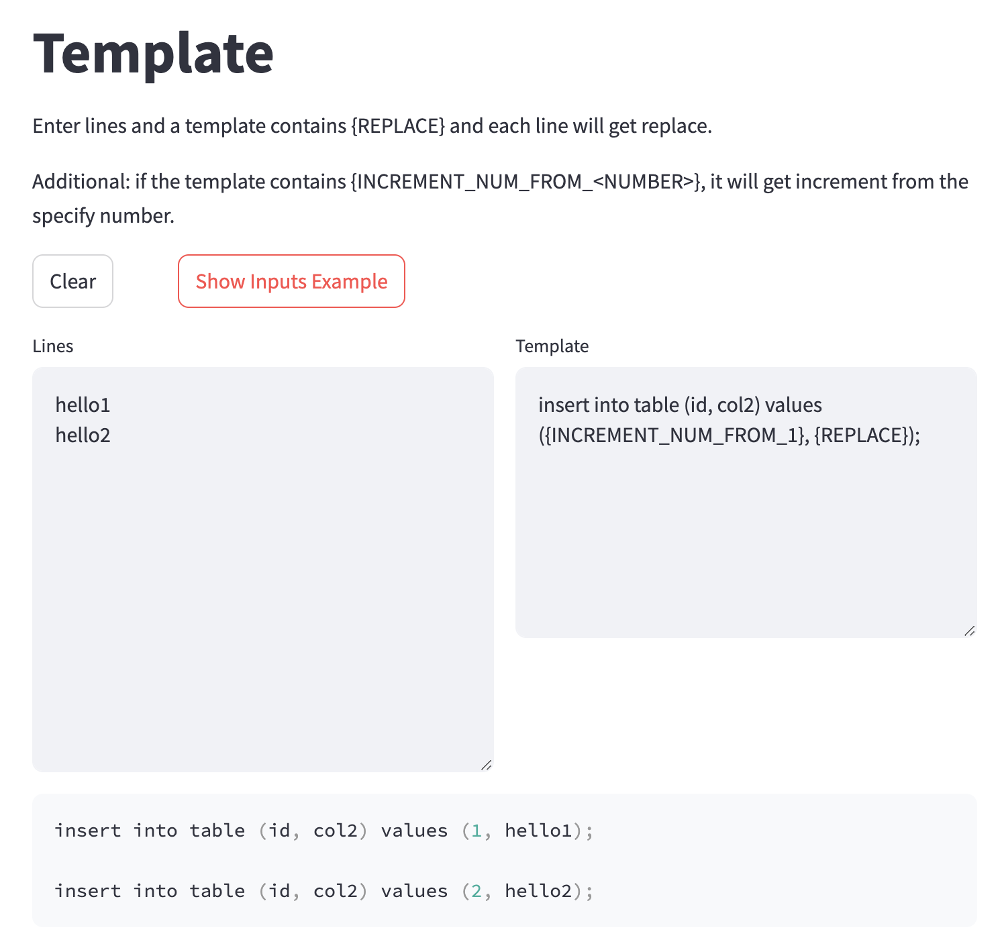
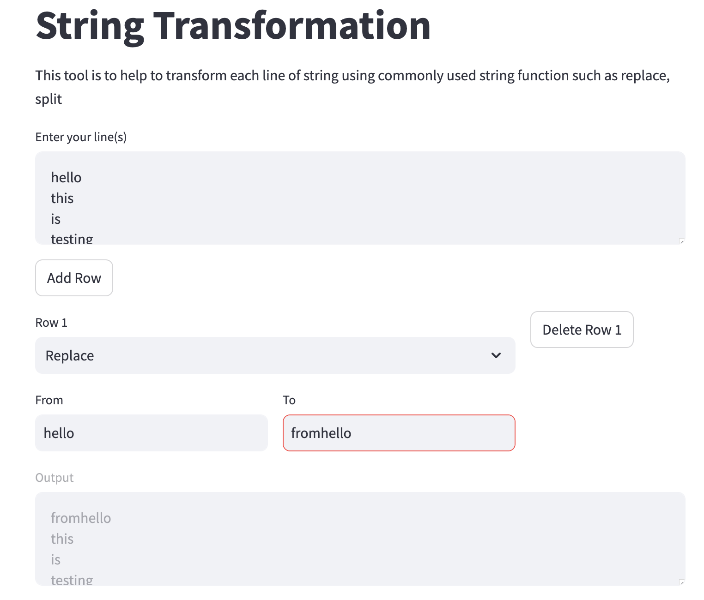

# yet-another-dev-productivity-tools
Yet another dev web app productivity tools that helps to improve productivity with simple in-built functionalities.

## Prerequisites

At least Python 3.7

## Project Setup & Commands

### Install venv

```shell
python3 -m venv .venv
```

### Install required library

#### Windows

```powershell
.venv\Scripts\Activate.ps1

pip install -r requirements.txt
```

#### Mac

```shell
source .venv/bin/activate

pip install -r requirements.txt
```

### Run the program

#### Windows

```powershell
.\run.ps1
```

#### Mac

```shell
./run.sh
```

## Features

### Copy Json Inside Json



### List Conversion



### Template



### String Transformation



## Impetus

I always find it there will be always tasks that need to manipulate lines so i built this application is for my own convenience to help me manipulate lines easily as well as learning Streamlit.
